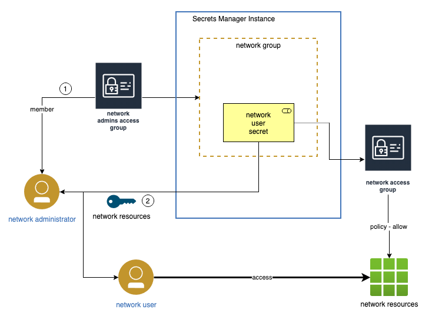

# Secrets Manager integration

It is useful to integrate this project with the secrets manager.  It is then possible to `become` a team member by creating a dynamic iam_credential secret associated for the team's iam access group.  The payload for the secret will include the api_key.

Benefits:
- Automatic expiration of api key
- Logged access of key generation

By creating an access group for each team The company will continue to allow atonomy for the teams 

Process:
- Admin creates:
  - secrets manager instance
  - For each team:
    - team admins access group
    - secret manager group
    - secret manager dynamic iam_secret role

- Team admin
  - creates an apikey (dynamic read) to investigate a problem
  - copy/paste apikey to network user
  - releases apikey when complete (or automatically expires)

Issues:
- Team admin needs to copy/paste the api key to the team user
- Team user can not release the secret when complete

